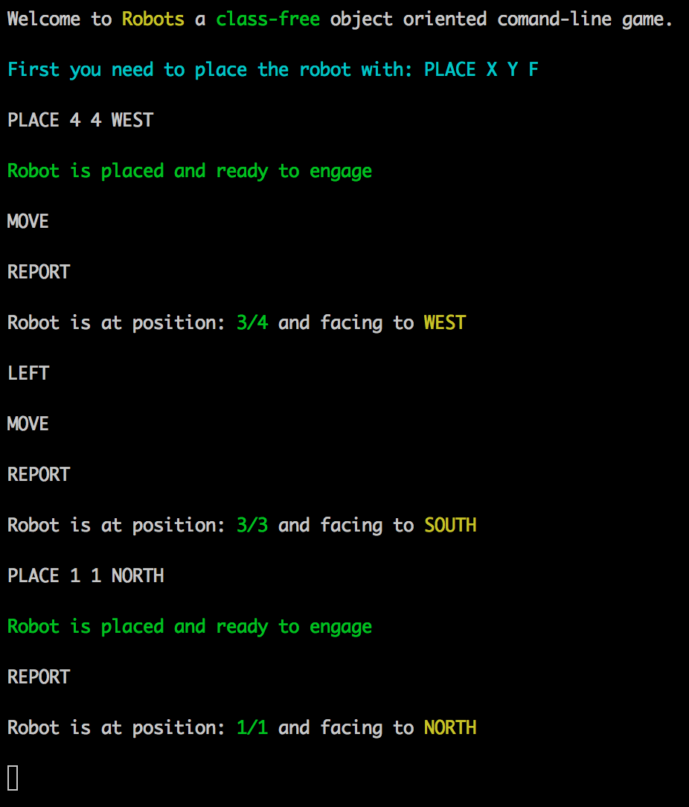

# Robots

A simulation of a toy robot moving on a square tabletop, of dimensions 5 units x 5 units. It´s written in ecmascript 6 & 7 features and tested with mocha and chai.

## Installation

Install npm dependencies:

    $ npm install

Build target assets:

    $ grunt build

## Usage

    $ node binary/robots.js

If the package is installed globally you can just run:

    $ robots

## Commands

  

#### PLACE X Y F

Put the toy robot on the table in position X,Y and facing NORTH, SOUTH, EAST or WEST. If the robot is already placed, issuing another valid PLACE command will place the robot in the newly specified location.

#### MOVE

Moves the toy robot one unit forward in the direction it is currently facing.

#### LEFT

Rotates the robot 90 degrees to the left (i.e. counter-clockwise) without changing the position of the robot.

#### RIGHT

Rotates the robot 90 degrees to the right (i.e. clockwise) without changing the position of the robot.

#### REPORT

Announces the X,Y and F of the robot.

## Development

    $ grunt start

## Testing

Run tests:

    $ grunt test

Check test coverage (after running grunt test):

    $ open target/coverage.html
